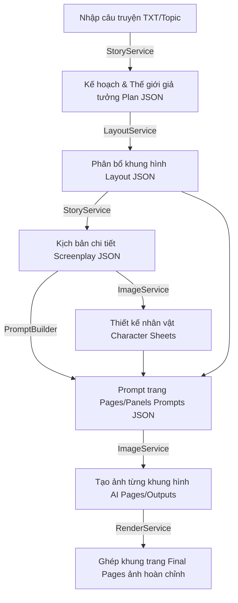

# 📖 React AI Comic Book Editor & Pipeline Visualizer (Dự Án Tạo Truyện Tranh Tự Động)

Dự án này là một ứng dụng Web UI tương tác cao được xây dựng trên nền tảng **React**, **TypeScript**, **Vite** và **Tailwind CSS v4**, kết hợp với một backend **Node.js Express** và các công cụ xử lý thị giác máy tính chuyên sâu bằng **Python** (sử dụng EasyOCR, OpenCV, YOLOv8).

Hệ thống cho phép hiển thị, kiểm duyệt, biên tập kịch bản, tự do điều chỉnh bố cục khung tranh (kể cả khung đa giác nghiêng độc đáo) và tối ưu hóa vị trí bong bóng thoại trong các trang truyện tranh được tạo ra tự động bởi mô hình AI.

---

## 🗺️ Sơ đồ Luồng Dữ liệu (Data Flow)

Quy trình xử lý của hệ thống bắt đầu từ việc đọc nội dung văn bản cho đến khi xuất ra trang truyện tranh hoàn chỉnh:



### Chi tiết các bước:
1. **Lên Kế Hoạch & Xây Dựng Thế Giới (Planning & World Building):** AI đọc truyện gốc (VD: `tam_cam.txt`, `thanh_giong.txt`), xác định phong cách nghệ thuật, bối cảnh và nhân vật rồi lưu vào `plan.json`.
2. **Thiết Kế Bố Cục Khung Tranh (Layout Generation):** Tính toán và chia các khung hình (panels) vào từng trang để tạo ra `layout.json` mô tả tọa độ và kích thước của các khung hình.
3. **Đạo Diễn Phân Cảnh (Scene Directing):** Phân chia cốt truyện vào từng panel tương ứng và xuất ra kịch bản chi tiết (`screenplay_final.json`).
4. **Tạo Hình Nhân Vật (Character Sheets):** Dựng minh họa các nhân vật chủ chốt lưu tại `ai_chars/` hoặc `chars_output/` để đảm bảo tính nhất quán của nét vẽ.
5. **Tạo Prompts Trang (Build Page Prompts):** Tổng hợp prompt vẽ chi tiết cho từng panel dựa trên kịch bản và thiết kế nhân vật, lưu vào `panels_with_prompts.json`.
6. **Khởi Tạo Hình Ảnh Khung Tranh:** Gọi API AI vẽ ảnh theo prompt để tạo ra các ảnh khung đơn lẻ trong thư mục `ai_output/`.
7. **Hoàn Thiện Trang Truyện (Finalizing Pages):** Lấy các ảnh gốc, ghép dán theo tọa độ định sẵn từ `layout.json` và chèn thoại/lời dẫn để xuất ra `final_pages/`.

---

## ✨ Các Tính Năng Nổi Bật Trên Web UI

### 📂 1. Quản Lý Thư Mục Kết Quả (Run Folder Picker)
- Ứng dụng đọc file danh mục chạy tự động `run_index.json` để hiển thị danh sách các đợt sinh truyện (`run_YYYYMMDD_HHMM_xxxxxxxx`).
- Cho phép người dùng chuyển đổi linh hoạt giữa các phiên bản truyện tranh, tự động tải kịch bản, danh sách nhân vật, hình ảnh khung hình, và các trang hoàn chỉnh tương ứng.
- Có chế độ nhập tên thư mục kết quả thủ công.

### 📐 2. Trình Hiệu Chỉnh Bố Cục Đa Giác Nghiêng (Skewed Layout Editor)
- **Chế độ Chỉnh Layout:** Cho phép thay đổi hình dạng chữ nhật truyền thống của khung tranh thành dạng đa giác nghiêng (polygon skewed layout) bằng cách kéo thả trực tiếp các điểm neo (vertex joint handles) liên kết giữa các khung hình trên trang.
- **Tự Động Lưu:** Tọa độ mới của các điểm neo và khung ảnh (bounding box) được cập nhật và lưu ngay lập tức về file `layout.json` ở server thông qua API Node.js.
- **Stationary Image:** Khi kéo dịch chuyển góc khung hình, thuật toán tự tính toán độ lệch (offset) để dịch chuyển ảnh nền bên trong ngược lại, giữ cho nội dung/nhân vật trong ảnh không bị lệch khỏi tầm mắt người xem.

### 🔍 3. Tương Tác Ảnh Trong Khung (Image Transform Control)
- Người dùng có thể kéo thả để di chuyển ảnh (pan) và cuộn chuột (scroll wheel) để thu phóng (zoom scale) ảnh bên trong mỗi khung hình để căn góc đẹp nhất cho nhân vật.

### 💬 4. Nhận Diện & Căn Chỉnh Hộp Thoại AI (Speech Bubble OCR & Drag)
- Tích hợp công cụ phân tích ảnh panel bằng Python:
  - Sử dụng **EasyOCR** để đọc văn bản và định vị vùng chứa chữ.
  - Sử dụng giải thuật phân tích vùng liên thông (**Connected Components**) với ngưỡng sáng (threshold > 215) để tự động nhận diện phần viền ngoài của bong bóng hội thoại màu trắng (speech bubble area).
  - Giải thuật fallback: Nếu không có EasyOCR hoặc không thấy chữ, hệ thống sử dụng thuật toán dò tìm blob màu trắng thông thường trong tầm tỷ lệ khung hình cho phép.
  - Tự động gộp các hộp thoại bị trùng lặp bằng thuật toán **Non-Maximum Suppression (NMS)** với IoU threshold = 0.3.
- Trong giao diện Web, các bong bóng thoại được cắt ra (crop) dưới dạng lớp phủ vector/ảnh động, cho phép người dùng **kéo thả trực tiếp** để thay đổi vị trí bong bóng thoại trên khung truyện một cách mượt mà.

### 📝 5. Biên Tập Kịch Bản & Sinh Lại Ảnh Bằng AI
- Cho phép thay đổi trực tiếp thông tin kịch bản: Lời thoại (dialogues), lời dẫn truyện (narration), prompt mô tả AI.
- Hỗ trợ nút **Sinh ảnh AI** để tái tạo nhanh hình ảnh cho một khung tranh cụ thể sau khi đã cập nhật lại prompt.

### 📖 6. Chế Độ Trình Chiếu (Reader Mode)
- Trải nghiệm đọc truyện chuyên nghiệp với giao diện tối giản, tập trung tối đa vào trang truyện tranh, hỗ trợ chuyển trang bằng chuột hoặc phím mũi tên.

### 💾 7. Xuất Bản Chất Lượng Cao
- **Xuất ảnh PNG:** Chụp canvas truyện và xuất ra file ảnh chất lượng cao (hỗ trợ `pixelRatio: 2` cho hình ảnh sắc nét), tự động ẩn các công cụ chỉnh sửa và đường viền nháp.
- **Xuất Layout JSON:** Xuất tọa độ khung hình và đa giác của trang hiện tại để lưu trữ hoặc tái sử dụng.

---

## 🛠️ Công Nghệ Sử Dụng

### Giao Diện (Frontend)
- **React 19 + TypeScript + Vite**
- **Zustand:** Quản lý State tập trung cho kịch bản, nhân vật và dữ liệu trang (`useStoryStore`).
- **Tailwind CSS v4:** Xây dựng giao diện hiện đại với các hiệu ứng kính mờ (glassmorphism), chuyển động mượt mà (micro-animations).
- **lucide-react:** Bộ icon vector.
- **react-rnd:** Hỗ trợ tính năng kéo thả và thay đổi kích thước khung hình.
- **html-to-image / html2canvas:** Trích xuất canvas HTML sang ảnh PNG chất lượng cao.

### Máy Chủ Lưu Trữ & Xử Lý (Backend)
- **Node.js Express:**
  - Chạy local tại cổng `3005`.
  - Cung cấp các API lưu trữ dữ liệu cập nhật: `/api/save-characters`, `/api/save-panels`, `/api/save-layout`.
  - API xử lý AI `/api/detect-text` dùng để gọi tiến trình con chạy script Python nhận diện bong bóng thoại.
- **Python (Thư mục `tach_box_text/`):**
  - Thực hiện các giải thuật xử lý ảnh nâng cao.
  - Tích hợp EasyOCR, OpenCV (cv2) và YOLOv8 (để nhận dạng người / nhân vật trong khung ảnh).

---

## 📂 Cấu Trúc Thư Mục Dự Án

```text
├── public/                      # Tài nguyên tĩnh & dữ liệu của các đợt chạy (run folders)
│   ├── run_index.json           # Danh mục các run khả dụng
│   ├── characters_db.json       # Cơ sở dữ liệu gốc của các nhân vật truyện
│   └── run_xxxxxxxx_xxxx/       # Dữ liệu riêng của một phiên chạy cụ thể
│       ├── layout.json          # Tọa độ khung hình của từng trang
│       ├── screenplay_parsed.json # Kịch bản và nhân vật chi tiết
│       ├── panels_with_prompts.json # Phân cảnh kèm prompt vẽ của từng panel
│       ├── chars_output/        # Ảnh thiết kế chân dung nhân vật
│       ├── ai_output/           # Ảnh vẽ thô từ AI cho từng panel
│       └── final_pages/         # Ảnh trang truyện tranh đã ghép hoàn thiện
│
├── src/
│   ├── main.tsx                 # Điểm khởi đầu của ứng dụng React
│   ├── App.tsx                  # Giao diện chính và hệ thống Stepper
│   ├── App.css & index.css      # Cấu hình phong cách và Tailwind CSS v4
│   ├── types/
│   │   └── index.ts             # Định nghĩa cấu trúc dữ liệu chính (Character, PanelData, etc.)
│   ├── store/
│   │   └── useStoryStore.ts     # Quản lý trạng thái và giao tiếp API
│   ├── services/
│   │   └── characterDb.ts       # Service quản lý dữ liệu nhân vật phụ trợ
│   └── components/
│       ├── ScenarioStep.tsx     # Bước 1: Giao diện chọn thư mục Run Folder
│       ├── ResultStep.tsx       # Bước 2: Giao diện làm việc chính (Trình xem/Biên tập trang)
│       ├── ComicPanel.tsx       # Hiển thị và tương tác ảnh/layout đa giác của từng khung hình
│       ├── PanelEditor.tsx      # Drawer chỉnh sửa lời thoại, prompt AI & gọi detect bong bóng thoại
│       ├── ScreenplayPanel.tsx  # Sidebar hiển thị toàn bộ kịch bản truyện dạng text
│       └── ReaderMode.tsx       # Chế độ đọc truyện toàn màn hình
│
├── tach_box_text/               # Thư mục xử lý thị giác máy tính bằng Python
│   ├── box_detector.py          # Thư viện thuật toán OCR, Connected Components và YOLOv8
│   └── detect_wrapper.py        # File wrapper nhận tham số ảnh từ Node.js và xuất JSON kết quả
│
├── scripts/
│   └── copyRuns.js              # Script phụ trợ sao chép thư mục run vào thư mục build (dist)
├── save_server.js               # Máy chủ trung gian Node.js Express lưu file và gọi Python
├── tailwind.config.js           # Cấu hình Tailwind CSS
└── tsconfig.json / vite.config.ts # Các tệp cấu hình TypeScript và Vite
```

---

## 🚀 Hướng Dẫn Cài Đặt & Chạy Ứng Dụng

Để chạy ứng dụng ở máy cá nhân, hãy chuẩn bị cả môi trường Node.js và Python.

### Bước 1: Cài đặt và Chạy Giao Diện (Frontend)
1. Di chuyển vào thư mục dự án và cài đặt các thư viện Node.js:
   ```bash
   npm install
   ```
2. Khởi chạy ứng dụng Web ở chế độ phát triển:
   ```bash
   npm run dev
   ```
   *Mặc định web sẽ chạy tại địa chỉ: `http://localhost:5173`*

### Bước 2: Cài đặt và Chạy Máy Chủ Lưu Trữ & Xử Lý (Backend)
1. Cài đặt các thư viện Python cần thiết (dùng cho tính năng nhận diện bong bóng thoại bằng OCR và OpenCV):
   ```bash
   pip install opencv-python numpy easyocr
   # Cài đặt thêm nếu muốn dùng tính năng nhận dạng nhân vật bằng YOLOv8:
   # pip install ultralytics
   ```
2. Khởi chạy máy chủ Node.js Express để xử lý API lưu file và gọi Python:
   ```bash
   node save_server.js
   ```
   *Máy chủ Express chạy tại địa chỉ: `http://localhost:3005`*

### Bước 3: Build Dự Án (Khi Deploy)
Để build sản phẩm hoàn chỉnh sang thư mục `dist/` kèm theo việc tự động sao chép các thư mục dữ liệu `run_*` sang thư mục đích:
```bash
npm run build
```

---

## ⌨️ Phím Tắt Tiện Dụng Trên Giao Diện

Khi đang xem trang truyện tranh ở bước Kết quả, bạn có thể sử dụng các phím tắt nhanh sau:
- **Phím mũi tên sang phải (ArrowRight) hoặc mũi tên xuống (ArrowDown):** Chuyển sang trang truyện tiếp theo.
- **Phím mũi tên sang trái (ArrowLeft) hoặc mũi tên lên (ArrowUp):** Quay lại trang trước.
- **Phím R:** Mở nhanh chế độ Trình Chiếu Đọc Truyện (Reader Mode).
- **Phím S:** Bật/Tắt khung hiển thị kịch bản chi tiết bên cạnh.
- **Phím ESC:** Hủy chọn khung hình đang xem hoặc đóng Sidebar kịch bản.
